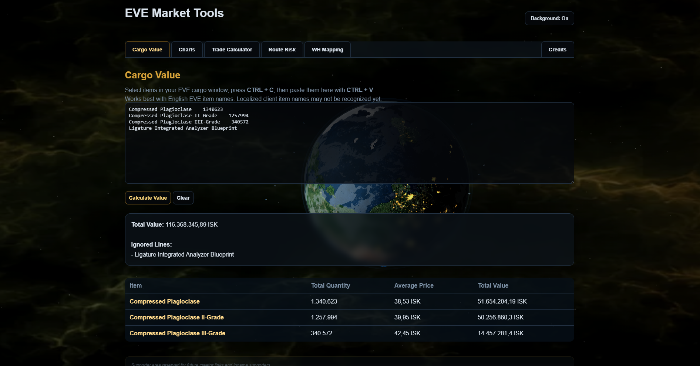
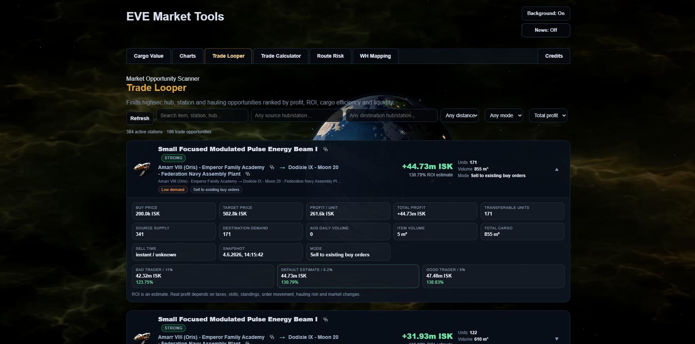
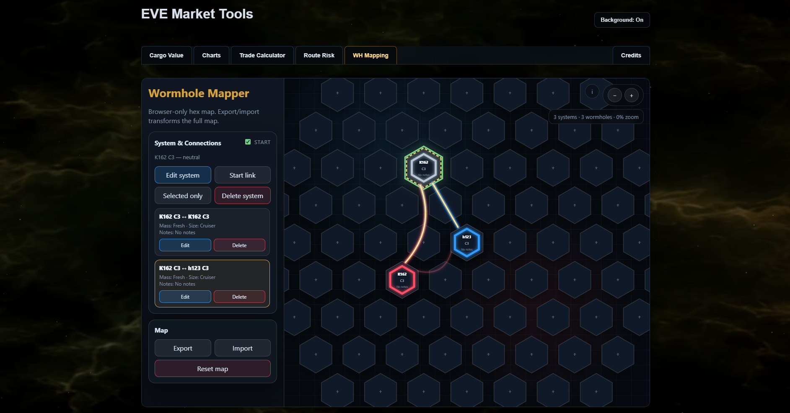

# EVE Trade Intelligence Platform

🌐 Live Platform: https://eve-tradelooper.com/

Containerized market analytics and logistics intelligence platform for EVE Online.

Built as a real-world infrastructure engineering portfolio project using Linux, Docker, PostgreSQL, FastAPI, Python workers, observability tooling, and modular frontend systems.

---

# 🚀 Core Features

| Area | Features |
|---|---|
| Infrastructure | Hardened Ubuntu Server, Docker Compose stack, service isolation |
| Backend | FastAPI API layer, modular worker architecture, scheduled ingestion |
| Database | PostgreSQL analytics database, historical market storage |
| Data Pipeline | Automated ESI imports, paginated sync system, snapshot aggregation |
| Market Intelligence | Trade Looper, Route Risk Calculator, Wormhole Mapper, Cargo Analysis |
| Analytics | Trade recommendations, ROI analysis, MAV15 liquidity scoring |
| Frontend | Interactive dashboard, multi-chart analytics, modular tool ecosystem |
| News System | AHN News Network, lore feed, event feed architecture |
| Observability | Discord monitoring, runtime metrics, import reporting |
| Localization | Multilingual EVE item support |
| Architecture | Hybrid-cloud ready structure with Azure integration planning |

---

# 📊 Current Scale

| Metric | Value |
|---|---|
| Indexed Items | ~16,800 |
| Historical Market Records | ~848,000 |
| Trade Hubs Supported | Jita, Amarr, Dodixie, Hek, Rens |
| Data Sources | ESI Regional History + Live Market Snapshots |
| Frontend Charts | Hourly + Daily analytics modes |
| Git Commits | 177+ |
| Deployment | Public Production Instance |

---

# 🧱 Architecture

```text
Ubuntu Server
│
├── Docker Compose
│   ├── PostgreSQL
│   ├── FastAPI Backend
│   ├── Worker Orchestrator
│   └── Frontend
│
├── Market Ingestion Engine
├── Historical Analytics Engine
├── Trade Recommendation Engine
├── AHN News System
├── Monitoring & Observability
└── Interactive Web Dashboard
```

---

# ⚙️ Key Engineering Decisions

* Worker decomposition

  * split monolithic worker.py into focused ingestion, enrichment and orchestration modules

* Incremental paginated market synchronization

  * prevents ESI timeout and 504 instability

* Strict trade-hub filtering

  * removes false arbitrage from citadels and edge stations

* Historical + live snapshot combination

  * enables long-term analytics and future AI-assisted analysis

* Fee-aware trade calculations

  * realistic profitability instead of fake raw spread numbers

* Frontend modularization

  * independent feature modules for easier maintenance and expansion

* Lightweight frontend architecture

  * responsive browser performance without heavy frameworks

* Public deployment architecture

  * self-hosted production deployment with monitoring and observability

---

# 📂 Repository Structure

```text
frontend/   -> dashboard, tools, UI modules and assets
api/        -> FastAPI endpoints and analytics services
worker/     -> ingestion, enrichment and orchestration services
docs/       -> infrastructure and architecture documentation
diagrams/   -> architecture and schema diagrams
infra/      -> deployment and infrastructure helpers
scripts/    -> automation and utility scripts
assets/     -> screenshots and visual assets
```

---

# 📚 Documentation

| File | Topic |
|---|---|
| `01-linux-baseline.md` | Ubuntu setup & hardening |
| `02-docker-platform.md` | Container architecture |
| `03-database-layer.md` | PostgreSQL design |
| `04-api-layer.md` | FastAPI backend |
| `05-web-dashboard.md` | Frontend architecture |
| `06-observability.md` | Monitoring & logging |
| `07-hybrid-cloud-planning.md` | Azure and hybrid-cloud concepts |
| `08-cicd-automation.md` | CI/CD planning |
| `09-lessons-learned.md` | Engineering lessons and post-mortem |

---

# 🖼️ Platform Preview









---

# 🛠️ Technology Stack

```text
Ubuntu Server
Docker Compose
PostgreSQL
FastAPI
Python
JavaScript
Chart.js
Discord Webhooks
Mermaid
```
