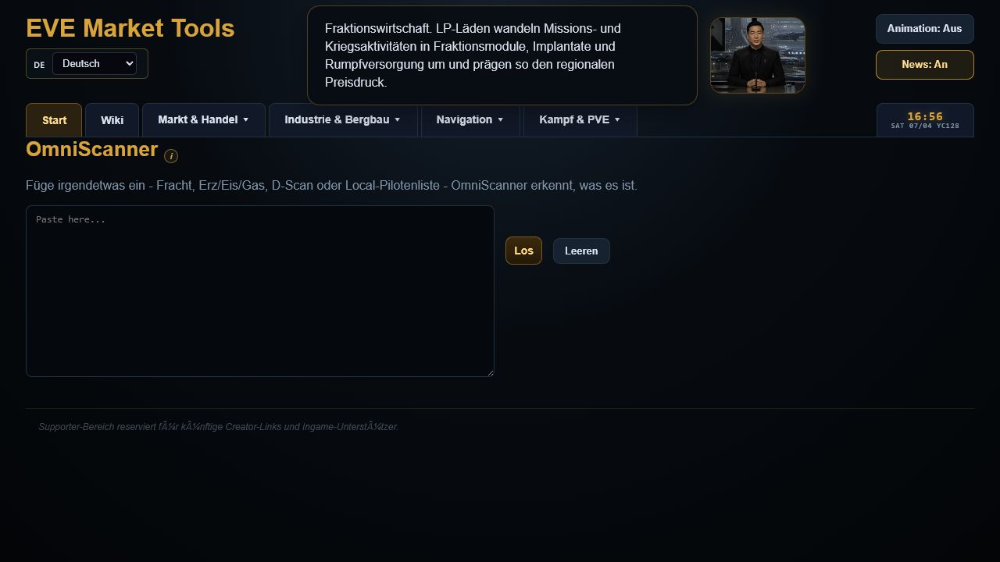
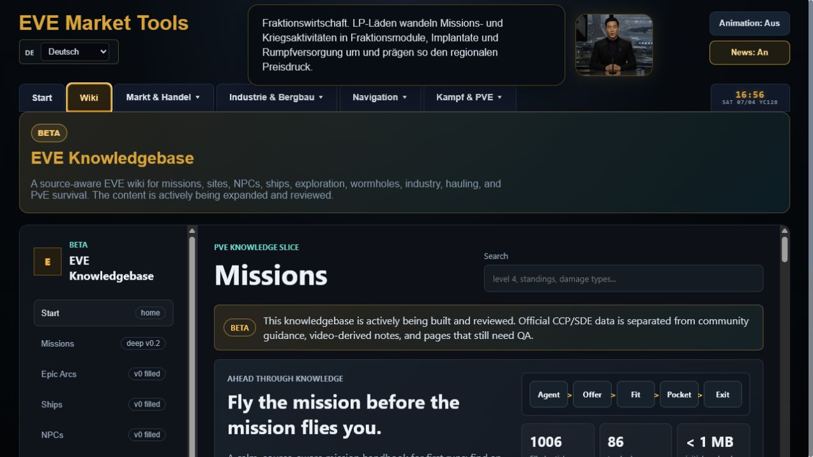
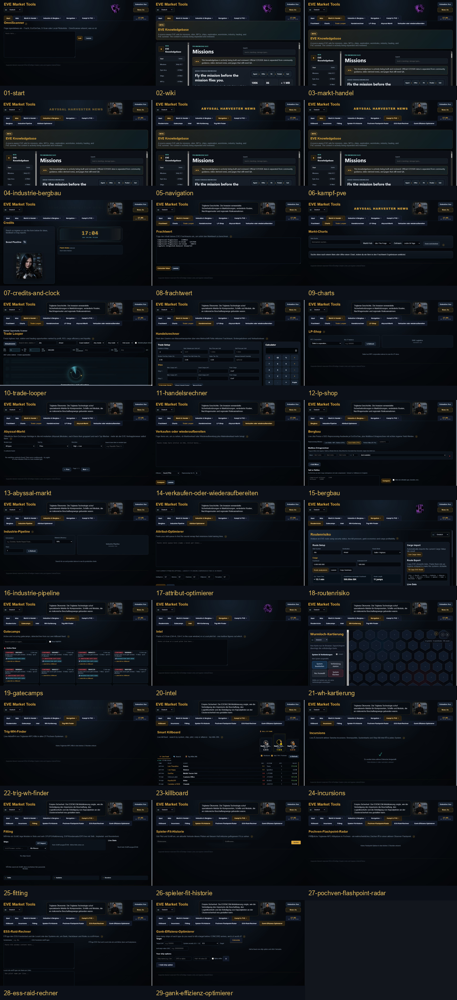

# EVE Trade Intelligence Platform

🌐 Live Platform: https://eve-tradelooper.com/

Containerized market analytics and logistics intelligence platform for EVE Online.

Built as a real-world infrastructure engineering portfolio project using Linux, Docker, PostgreSQL, FastAPI, Python workers, observability tooling, and modular frontend systems.

---

# 🚀 Core Features

| Area                | Features                                                                  |
| ------------------- | ------------------------------------------------------------------------- |
| Infrastructure      | Hardened Ubuntu Server, Docker Compose stack, service isolation           |
| Backend             | FastAPI API layer, modular worker architecture, scheduled ingestion       |
| Database            | PostgreSQL analytics database, historical market storage                  |
| Data Pipeline       | Automated ESI imports, paginated sync system, snapshot aggregation        |
| Market Intelligence | Trade Looper, Route Risk Calculator, Wormhole Mapper, Cargo Analysis      |
| Gameplay Tools      | OmniScanner, ESS Raid Calculator, Trig WH Finder, Pochven Radar, Gank Optimizer |
| Analytics           | Trade recommendations, ROI analysis, MAV15 liquidity scoring              |
| Frontend            | Interactive dashboard, multi-chart analytics, modular tool ecosystem      |
| News System         | AHN News Network, lore feed, event feed architecture                      |
| Observability       | Discord alerts, email alerts, Azure Monitor, CYD display, runtime metrics |
| Privacy Design      | No user accounts, no login system, no personal user tracking              |
| Localization        | Multilingual EVE item support                                             |
| Architecture        | Self-hosted hybrid-cloud architecture with Azure Arc monitoring           |

---

# 📊 Current Scale

| Metric | Value |
|---|---|
| Market Records | Multi-million row PostgreSQL market database with active retention controls |
| Station Coverage | Hundreds of active market stations |
| Market Coverage | Main EVE trade hub regions and active station markets |
| Data Sources | ESI regional history, live market snapshots, station market data, live killmail streams |
| Chart Analytics | 24h to 365d time-range views with hourly and daily aggregation |
| Deployment | Public self-hosted production instance |
| Wiki Scope | Growing EVE knowledge base with guides, reference content and tool context |

---

# 🧱 Architecture

```text
Ubuntu Server
│
├── Docker Compose
│   ├── PostgreSQL
│   ├── FastAPI Backend
│   ├── Worker Orchestrator
│   └── Frontend
│
├── Market Ingestion Engine
├── Historical Analytics Engine
├── Trade Recommendation Engine
├── AHN News System
├── Monitoring & Observability
└── Interactive Web Dashboard
```

---

# ⚙️ Key Engineering Decisions

* Worker decomposition

  * split monolithic worker.py into focused ingestion, enrichment and orchestration modules

* Incremental paginated market synchronization

  * prevents ESI timeout and 504 instability

* Strict trade-hub filtering

  * removes false arbitrage from citadels and edge stations

* Historical + live snapshot combination

  * enables long-term analytics and future AI-assisted analysis

* Live kill-signal processing

  * supports gatecamp, Pochven, Triglavian wormhole and risk-intelligence tools from shared event streams

* Fee-aware trade calculations

  * realistic profitability instead of fake raw spread numbers

* Frontend modularization

  * independent feature modules for easier maintenance and expansion

* Privacy-first public access

  * designed without user accounts, login flows, or personal user profiles

* Operational review after stable production use

  * identified and fixed retention, worker overlap, log-management and exposure risks before they became long-term maintenance problems

* Lightweight frontend architecture

  * responsive browser performance without heavy frameworks

* Public deployment architecture

  * self-hosted production deployment with monitoring and observability

---

# 📂 Repository Structure

```text
docs/       -> infrastructure, operations and architecture documentation
frontend/   -> dashboard, tools and UI module documentation
diagrams/   -> architecture, data-flow and schema diagrams
assets/     -> screenshots and visual project assets
```

---

# 📚 Documentation

| File                          | Topic                                       |
| ----------------------------- | ------------------------------------------- |
| `01-linux-baseline.md`        | Ubuntu setup & hardening                    |
| `02-docker-platform.md`       | Container architecture                      |
| `03-database-layer.md`        | PostgreSQL design                           |
| `04-api-layer.md`             | FastAPI backend                             |
| `05-web-dashboard.md`         | Frontend architecture                       |
| `06-observability.md`         | Monitoring & logging                        |
| `07-hybrid-cloud-planning.md` | Azure and hybrid-cloud concepts             |
| `08-automation-operations.md` | Deployment workflow and operational automation |
| `09-lessons-learned.md`       | Engineering lessons and post-mortem         |

---

# 🖼️ Platform Preview

## Current Website







Full current UI screenshot pass:

```text
assets/tab-screenshots-2026-07-04/
```

## Website Version v1.0 Screenshot Archive

The original screenshot set is kept as a versioned visual archive of the earlier website state.


---

# 🛠️ Technology Stack

```text
Ubuntu Server
Docker Compose
PostgreSQL
FastAPI
Python
JavaScript
Chart.js
Discord Webhooks
Email Alerts
Azure Arc
Azure Monitor
Cloudflare
ESP32 CYD
Mermaid
```
