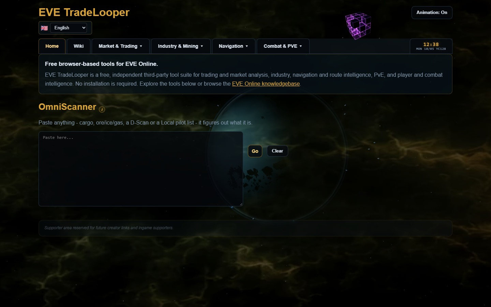
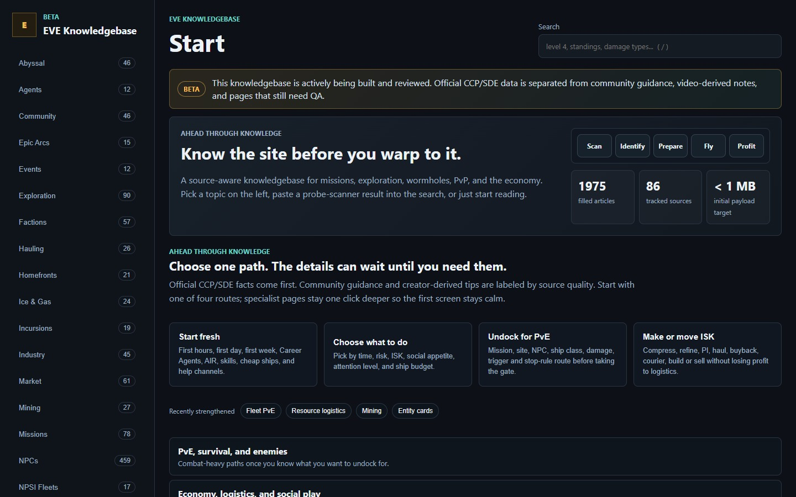
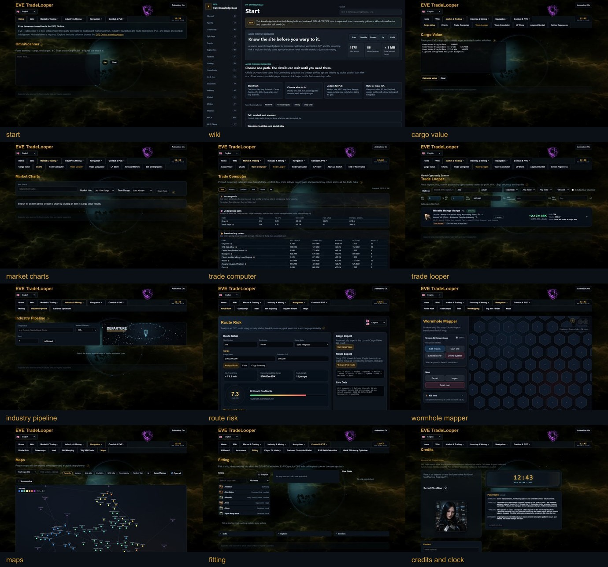
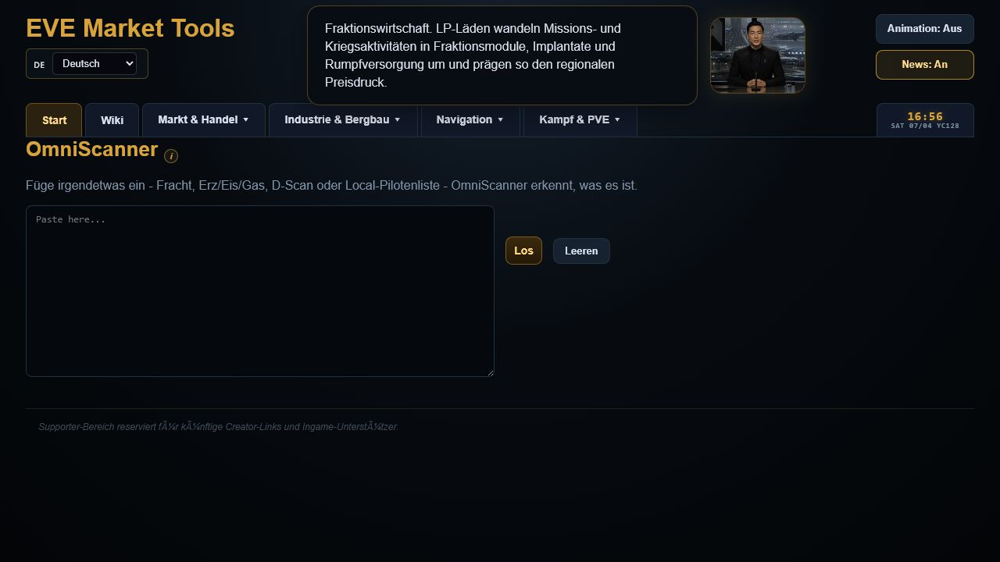
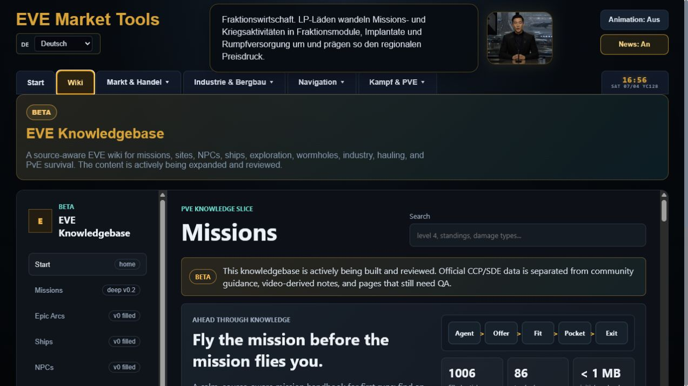
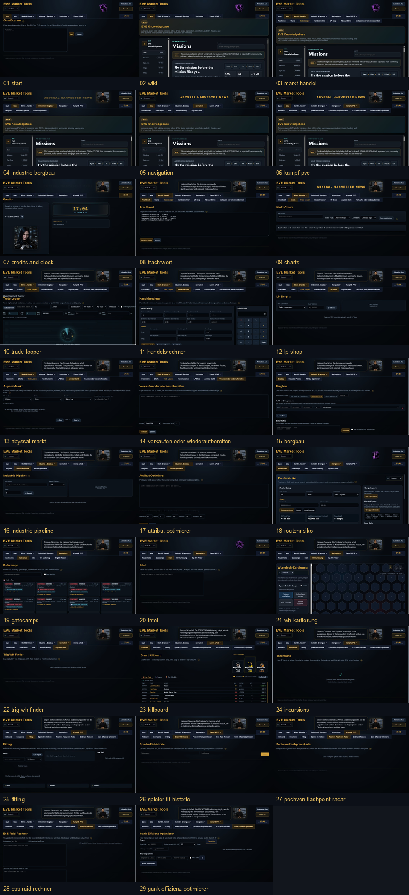
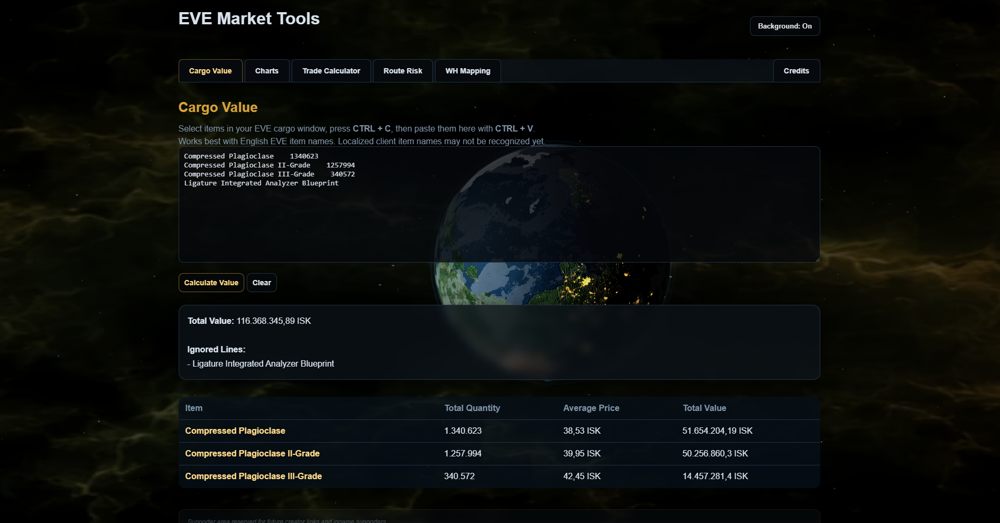
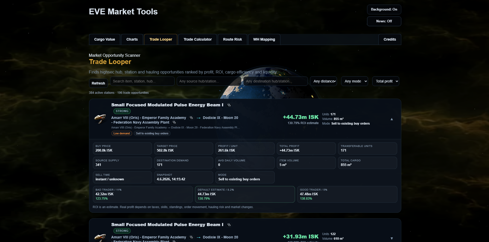
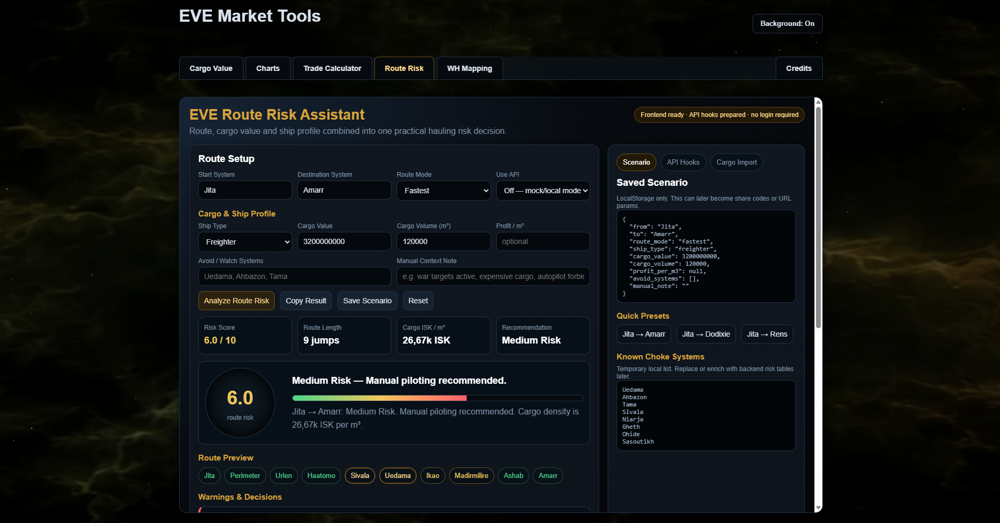
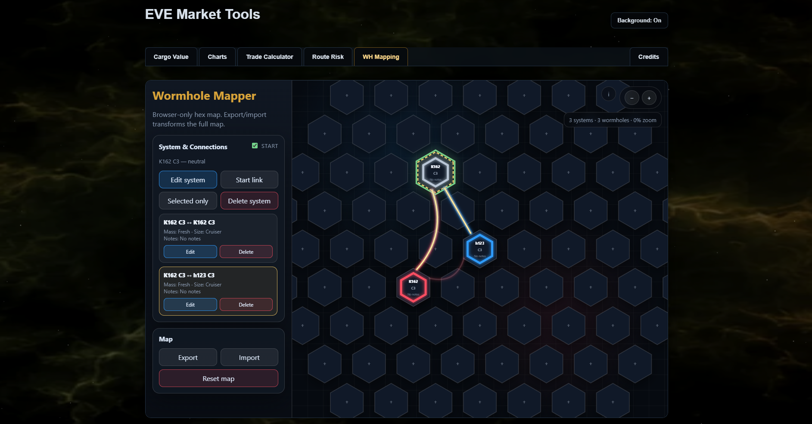

# EVE TradeLooper

🌐 Live Platform: https://eve-tradelooper.com/

Self-hosted browser tools for EVE Online trading, industry, navigation, PvE, and player and combat intelligence.

Built as a real-world infrastructure engineering portfolio project using Linux, Docker, PostgreSQL, FastAPI, Python workers, observability tooling, and modular frontend systems.

> **Repository scope.** This is the public architecture and engineering
> documentation for EVE TradeLooper. The production application source code,
> operational configuration, and secrets are maintained privately. This
> documentation was last synchronized with production in October 2026.

> **Component status.** Three components documented in this repository are
> not currently running: the Azure Arc / Azure Monitor integration, the ESP32
> CYD status display, and the AHN News Network. The first two were built,
> operated, and then deliberately retired — the Azure resources have since
> been deleted, the display was taken down. The AHN News Network is paused
> rather than retired: it shipped a full pipeline (multi-source news
> generation, an AI rewriter, live killmail signals, a WebGL widget) but did
> not draw meaningfully more traffic despite that investment, so the capacity
> behind it is being redirected elsewhere for now — it can be switched back on
> in minutes. All three stay documented on purpose. Building and running them
> was the point, and deciding to switch something off once it no longer earns
> its keep is part of operating a system rather than only assembling one.
> Unless a section is explicitly marked as historical, retired, or paused, it
> describes the current production platform.

---

# 🚀 Core Features

| Area                | Features                                                                  |
| ------------------- | ------------------------------------------------------------------------- |
| Infrastructure      | Hardened Ubuntu Server, Docker Compose stack, service isolation           |
| Backend             | FastAPI API layer, modular worker architecture, scheduled ingestion       |
| Database            | PostgreSQL analytics database, historical market storage                  |
| Data Pipeline       | Automated ESI imports, paginated sync system, snapshot aggregation        |
| Market Intelligence | Trade Looper, Trade Computer (mispricing radar & hub arbitrage), Route Risk Calculator, Wormhole Mapper, Cargo Analysis |
| Gameplay Tools      | OmniScanner, ESS Raid Calculator, Trig WH Finder, Pochven Radar, Gank Optimizer |
| Region Maps         | SDE-based interactive region/galaxy maps, live sovereignty & activity overlays, capital jump planner |
| Analytics           | Trade recommendations, ROI analysis, MAV15 liquidity scoring              |
| Frontend            | Interactive dashboard, multi-chart analytics, modular tool ecosystem      |
| News System         | AHN News Network, lore feed, event feed architecture (paused)              |
| Observability       | Discord alerts, email alerts, runtime metrics, retention and operations reporting |
| Privacy Design      | No user accounts, no login system, no personal user tracking              |
| Localization        | Multilingual EVE item support                                             |
| Architecture        | Self-hosted Docker architecture behind Cloudflare                         |

---

# 📊 Current Scale

| Metric | Value |
|---|---|
| Market Records | Multi-million row PostgreSQL market database with active retention controls |
| Station Coverage | Hundreds of active market stations |
| Market Coverage | Main EVE trade hub regions and active station markets |
| Data Sources | ESI regional history, live market snapshots, station market data, live killmail streams |
| Chart Analytics | 24h to 365d time-range views with hourly and daily aggregation |
| Deployment | Public self-hosted production instance |
| Wiki Scope | Growing EVE knowledge base with guides, reference content and tool context |

---

# 🧱 Architecture

```text
Ubuntu Server
│
├── Docker Compose
│   ├── PostgreSQL
│   ├── FastAPI Backend
│   ├── Worker Orchestrator
│   └── Frontend
│
├── Market Ingestion Engine
├── Historical Analytics Engine
├── Trade Recommendation Engine
├── AHN News System (paused; visual cube retained)
├── Monitoring & Observability
└── Interactive Web Dashboard
```

---

# ⚙️ Key Engineering Decisions

* Worker decomposition

  * split monolithic worker.py into focused ingestion, enrichment and orchestration modules

* Incremental paginated market synchronization

  * prevents ESI timeout and 504 instability

* Strict trade-hub filtering

  * removes false arbitrage from citadels and edge stations

* Historical + live snapshot combination

  * enables long-term analytics and future AI-assisted analysis

* Live kill-signal processing

  * supports gatecamp, Pochven, Triglavian wormhole and risk-intelligence tools from shared event streams

* Fee-aware trade calculations

  * realistic profitability instead of fake raw spread numbers

* Frontend modularization

  * independent feature modules for easier maintenance and expansion

* Privacy-first public access

  * designed without user accounts, login flows, or personal user profiles

* Operational review after stable production use

  * identified and fixed retention, worker overlap, log-management and exposure risks before they became long-term maintenance problems

* Lightweight frontend architecture

  * responsive browser performance without heavy frameworks

* Public deployment architecture

  * self-hosted production deployment with monitoring and observability

---

# 📂 Repository Structure

```text
docs/       -> infrastructure, operations and architecture documentation
frontend/   -> dashboard, tools and UI module documentation
diagrams/   -> architecture, data-flow and schema diagrams
assets/     -> screenshots and visual project assets
```

This repository documents the system; it is not a public mirror of the
production source tree.

---

# 📚 Documentation

| File                          | Topic                                       |
| ----------------------------- | ------------------------------------------- |
| `01-linux-baseline.md`        | Ubuntu setup & hardening                    |
| `02-docker-platform.md`       | Container architecture                      |
| `03-database-layer.md`        | PostgreSQL design                           |
| `04-api-layer.md`             | FastAPI backend                             |
| `05-web-dashboard.md`         | Frontend architecture                       |
| `06-observability.md`         | Monitoring & logging                        |
| `07-hybrid-cloud-planning.md` | Azure and hybrid-cloud concepts             |
| `08-automation-operations.md` | Deployment workflow and operational automation |
| `09-lessons-learned.md`       | Engineering lessons and post-mortem         |

---

# 🖼️ Platform Preview

## Current Website — October 2026







The representative October 2026 screenshot pass is available in:

```text
assets/tab-screenshots-2026-10-05/
```

The main-platform screenshots were captured at a 1440 × 900 browser viewport
with the animated world background and AHN WebGL cube enabled. Browser chrome
is not included. The Wiki is a separate interface and intentionally has no
animated main-platform background.

## July 2026 Website Snapshot

The following screenshots record the July 2026 interface. They are retained
as a dated visual snapshot and do not represent every later content,
compliance, or metadata update.







Full July 2026 UI screenshot pass:

```text
assets/tab-screenshots-2026-07-04/
```

## Website Version v1.0 Screenshot Archive

The original screenshot set is kept as a versioned visual archive of the earlier website state.









---

# 🧾 Contact & Community Contributions

The production platform includes a contact form and a moderated Wiki article
submission flow. Neither requires an account. Voluntary submissions are kept
in protected moderation queues and are never published automatically. See
`frontend/08-credits-and-compliance.md` for the data-handling summary.

---

# 🔄 Recent Production Updates

* Updated the platform for the September 2026 EVE/SDE data release
* Expanded the knowledgebase, OmniScanner, and Cradle of War content
* Hardened Cloudflare-only origin access and service startup behavior
* Improved database pruning reliability and operational error handling
* Added operations reporting, backup-capacity visibility, and DDNS health checks
* Updated the public entity metadata and CCP/DLA compliance notices

---

# 🛠️ Current Production Stack

```text
Ubuntu Server
Docker Compose
PostgreSQL
FastAPI
Python
JavaScript
Chart.js
Discord Webhooks
Email Alerts
Cloudflare
```

## Previously Operated Components

* Azure Arc and Azure Monitor — decommissioned; resources deleted
* ESP32 CYD status display — retired

## Paused Components

* AHN News Network feed pipeline, AI rewriter, and news popup — paused
* AHN WebGL cube — still active because it has no feed-pipeline cost

Mermaid is used for diagrams in this documentation repository.

---

# ©️ Rights and Reuse

Unless otherwise stated, original documentation and project-specific media in
this repository are © 2026 Björn Boldt. All rights reserved. EVE Online and
related trademarks, logos, images, and game assets remain the property of
their respective rights holders and are not licensed by this repository.
