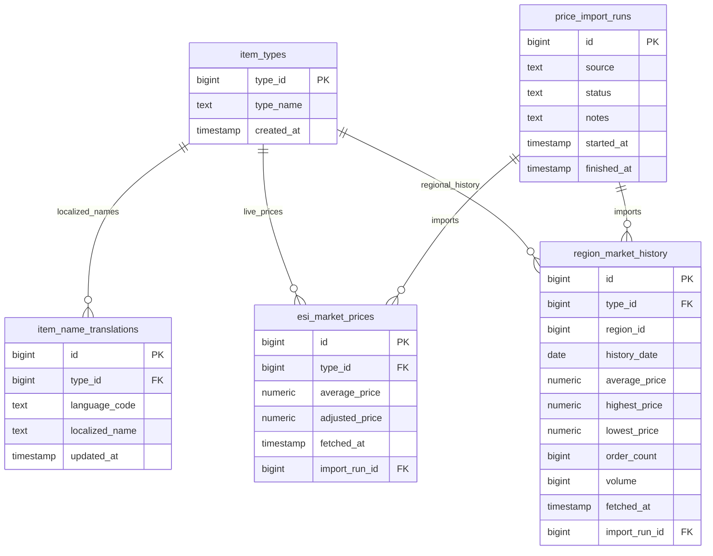

```mermaid
erDiagram

    item_types {
        bigint type_id PK
        text type_name
        timestamp created_at
    }

    item_name_translations {
        bigint id PK
        bigint type_id FK
        text language_code
        text localized_name
        timestamp updated_at
    }

    esi_market_prices {
        bigint id PK
        bigint type_id FK
        numeric average_price
        numeric adjusted_price
        timestamp fetched_at
        bigint import_run_id FK
    }

    region_market_history {
        bigint id PK
        bigint type_id FK
        bigint region_id
        date history_date
        numeric average_price
        numeric highest_price
        numeric lowest_price
        bigint order_count
        bigint volume
        timestamp fetched_at
        bigint import_run_id FK
    }

    price_import_runs {
        bigint id PK
        text source
        text status
        text notes
        timestamp started_at
        timestamp finished_at
    }

    item_types ||--o{ item_name_translations : localized_names
    item_types ||--o{ esi_market_prices : live_prices
    item_types ||--o{ region_market_history : regional_history

    price_import_runs ||--o{ esi_market_prices : imports
    price_import_runs ||--o{ region_market_history : imports
```
