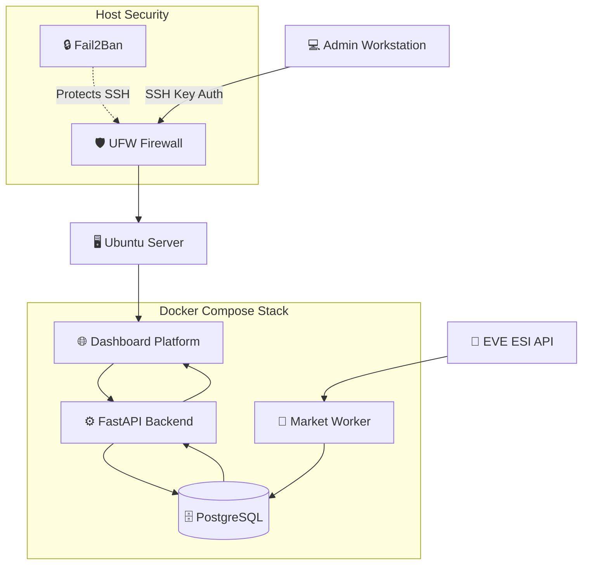

## Current Platform Architecture

```mermaid
graph TD

%% ----------- ACCESS -----------
Admin["💻 Admin Workstation"]

%% ----------- SECURITY -----------
subgraph Security["Host Security"]
    UFW["🛡️ UFW Firewall"]
    Fail2Ban["🔒 Fail2Ban"]
end

%% ----------- HOST -----------
Server["🖥️ Ubuntu Server"]

%% ----------- DOCKER -----------
subgraph Docker["Docker Compose Stack"]

    Frontend["🌐 Dashboard Platform"]

    API["⚙️ FastAPI Backend"]

    Worker["🔄 Market Worker"]

    DB[(🗄️ PostgreSQL)]

end

%% ----------- EXTERNAL -----------
ESI["📡 EVE ESI API"]

%% ----------- ACCESS -----------
Admin -->|SSH Key Auth| UFW
Fail2Ban -.->|Protects SSH| UFW
UFW --> Server

%% ----------- APPLICATION FLOW -----------
Server --> Frontend
Frontend --> API
API --> DB

%% ----------- DATA PIPELINE -----------
ESI --> Worker
Worker --> DB

%% ----------- ANALYTICS FLOW -----------
DB --> API
API --> Frontend
```
