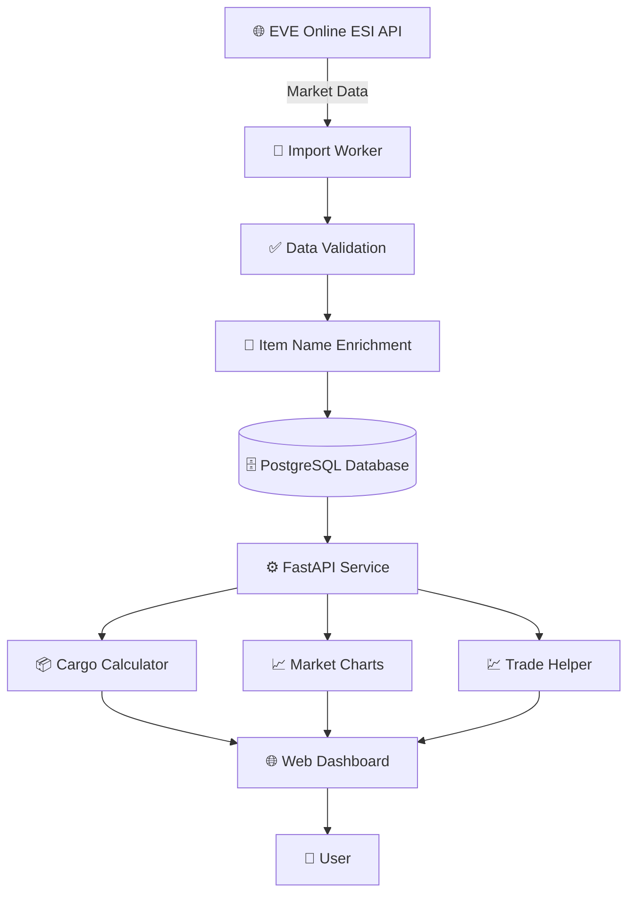

# Data Flow

```mermaid
graph TD

%% ----------- SOURCE -----------
ESI["🌐 EVE Online ESI API"]

%% ----------- IMPORT -----------
Worker["🔄 Import Worker"]

%% ----------- PROCESSING -----------
Validation["✅ Data Validation"]
Enrichment["🧩 Item Name Enrichment"]

%% ----------- STORAGE -----------
DB[(🗄️ PostgreSQL Database)]

%% ----------- API -----------
API["⚙️ FastAPI Service"]

%% ----------- FRONTEND -----------
Frontend["🌐 Web Dashboard"]

%% ----------- FEATURES -----------
Cargo["📦 Cargo Calculator"]
Charts["📈 Market Charts"]
Trade["💹 Trade Helper"]

%% ----------- USER -----------
User["👤 User"]

%% ----------- FLOW -----------
ESI -->|Market Data| Worker

Worker --> Validation
Validation --> Enrichment
Enrichment --> DB

DB --> API

API --> Cargo
API --> Charts
API --> Trade

Cargo --> Frontend
Charts --> Frontend
Trade --> Frontend

Frontend --> User
```
