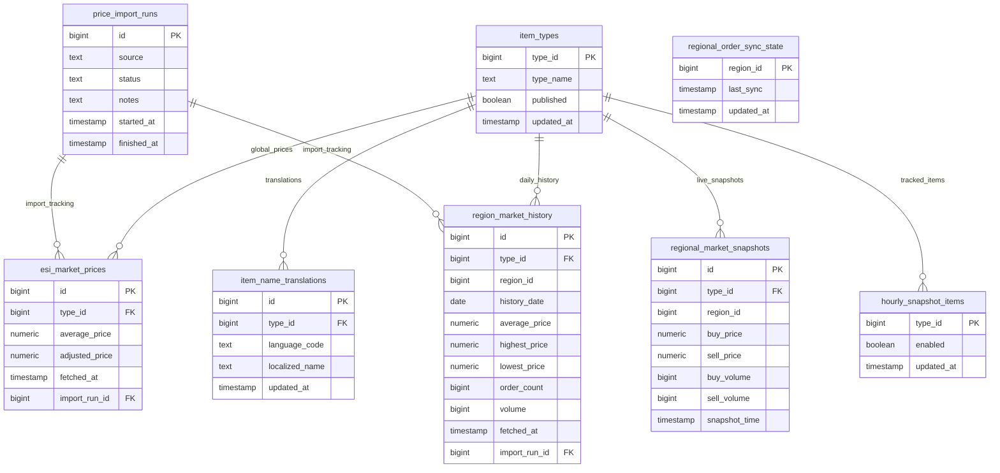

# Database Schema

Core PostgreSQL schema powering market analytics, historical storage, localization, snapshots, and worker operations.

```mermaid
erDiagram

    price_import_runs {
        bigint id PK
        text source
        text status
        text notes
        timestamp started_at
        timestamp finished_at
    }

    item_types {
        bigint type_id PK
        text type_name
        boolean published
        timestamp updated_at
    }

    item_name_translations {
        bigint id PK
        bigint type_id FK
        text language_code
        text localized_name
        timestamp updated_at
    }

    esi_market_prices {
        bigint id PK
        bigint type_id FK
        numeric average_price
        numeric adjusted_price
        timestamp fetched_at
        bigint import_run_id FK
    }

    region_market_history {
        bigint id PK
        bigint type_id FK
        bigint region_id
        date history_date
        numeric average_price
        numeric highest_price
        numeric lowest_price
        bigint order_count
        bigint volume
        timestamp fetched_at
        bigint import_run_id FK
    }

    regional_market_snapshots {
        bigint id PK
        bigint type_id FK
        bigint region_id
        numeric buy_price
        numeric sell_price
        bigint buy_volume
        bigint sell_volume
        timestamp snapshot_time
    }

    hourly_snapshot_items {
        bigint type_id PK
        boolean enabled
        timestamp updated_at
    }

    regional_order_sync_state {
        bigint region_id PK
        timestamp last_sync
        timestamp updated_at
    }

    item_types ||--o{ item_name_translations : translations

    item_types ||--o{ esi_market_prices : global_prices

    item_types ||--o{ region_market_history : daily_history

    item_types ||--o{ regional_market_snapshots : live_snapshots

    item_types ||--o{ hourly_snapshot_items : tracked_items

    price_import_runs ||--o{ esi_market_prices : import_tracking

    price_import_runs ||--o{ region_market_history : import_tracking
```
