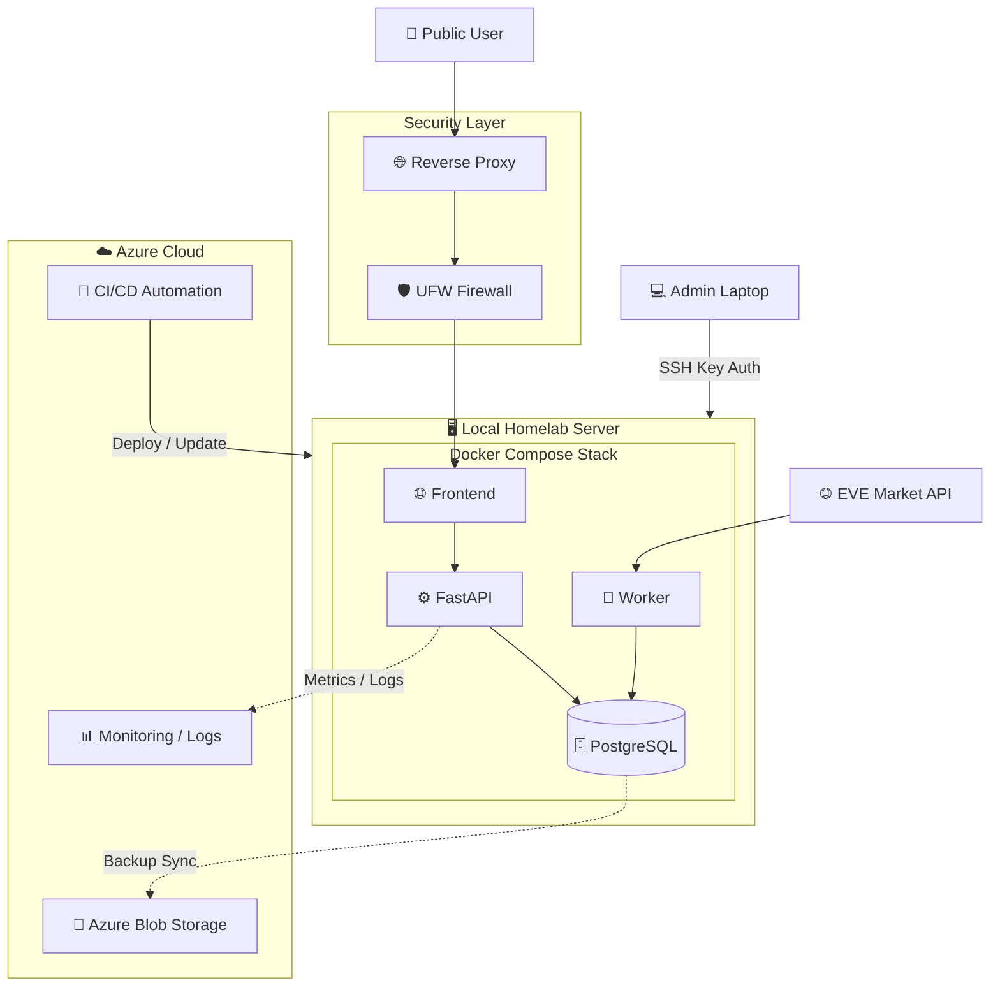

# Future Hybrid Architecture

```mermaid
graph TD

%% ----------- USERS -----------
User["👤 Public User"]
Admin["💻 Admin Laptop"]

%% ----------- SECURITY -----------
subgraph Security["Security Layer"]
    Proxy["🌐 Reverse Proxy"]
    Firewall["🛡️ UFW Firewall"]
end

%% ----------- LOCAL SERVER -----------
subgraph Local["🖥️ Local Homelab Server"]

    subgraph Docker["Docker Compose Stack"]
        Frontend["🌐 Frontend"]
        API["⚙️ FastAPI"]
        Worker["🔄 Worker"]
        DB[(🗄️ PostgreSQL)]
    end

end

%% ----------- AZURE -----------
subgraph Azure["☁️ Azure Cloud"]

    Storage["💾 Azure Blob Storage"]
    Monitor["📊 Monitoring / Logs"]
    CI["🧠 CI/CD Automation"]

end

%% ----------- ACCESS -----------
User --> Proxy
Proxy --> Firewall
Firewall --> Frontend

Admin -->|SSH Key Auth| Local

%% ----------- INTERNAL FLOW -----------
Frontend --> API
API --> DB
Worker --> DB

%% ----------- DATA SOURCE -----------
EVE["🌐 EVE Market API"]
EVE --> Worker

%% ----------- AZURE CONNECTIONS -----------
DB -.->|Backup Sync| Storage
API -.->|Metrics / Logs| Monitor
CI -->|Deploy / Update| Local
```
