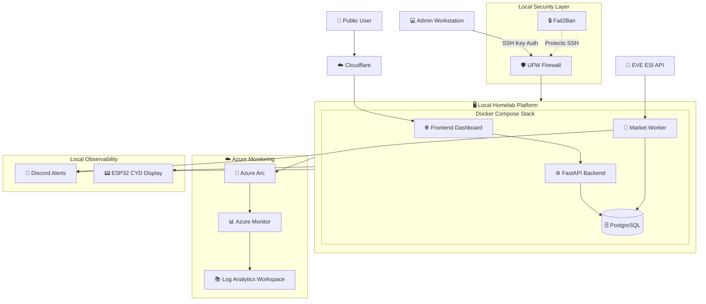

# Hybrid Cloud Architecture

Hybrid-cloud architecture for the EVE Trade Intelligence Platform.

The local platform remains the primary production system. Cloud services are used selectively for monitoring, visibility, and operational management.

## Notes

* Core workloads remain self-hosted.
* Azure is used for monitoring and hybrid visibility, not application hosting.
* PostgreSQL remains local and is not exposed publicly.
* Cloudflare handles public access, DNS, HTTPS, and edge protection.
* Discord and the ESP32 CYD display provide lightweight operational visibility.
