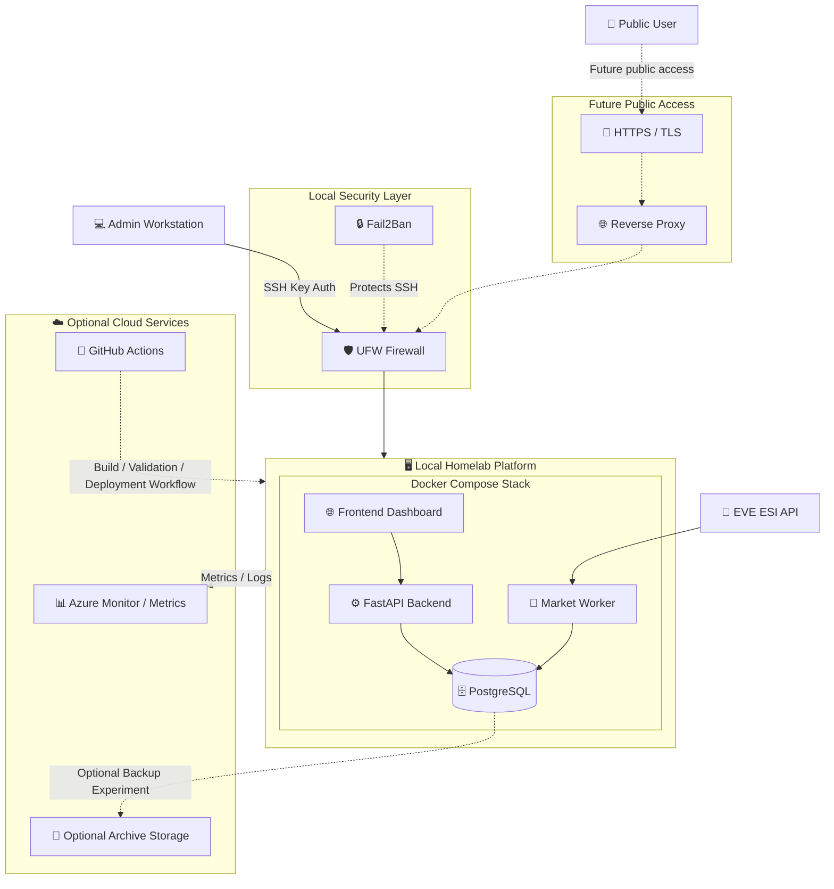

# Future Hybrid Cloud Architecture

Planned architecture direction for optional cloud and public deployment experiments.

The local platform remains the primary system. Cloud services are only added where they provide clear operational value, such as monitoring, deployment validation, or optional backup experiments.

## Notes

* Public access is planned, not required for local operation.
* Azure usage is optional and focused on monitoring experiments.
* Blob storage is treated as optional archive storage, not core infrastructure.
* The platform remains fully functional without cloud services.
