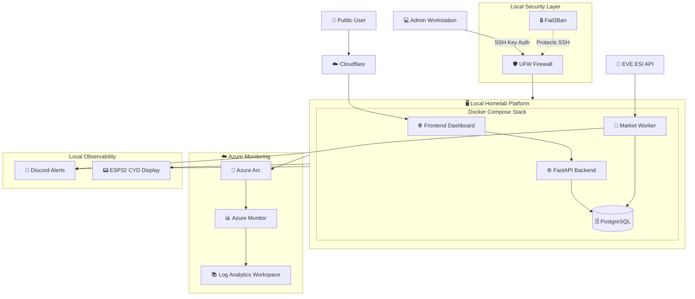

# Hybrid Cloud Architecture

Current production architecture combining a self-hosted platform with selected cloud services for monitoring, visibility, and operational management.

## Notes

* Core workloads remain self-hosted.
* PostgreSQL remains local and is not exposed publicly.
* Cloudflare provides DNS, HTTPS, and edge protection.
* Azure provides monitoring and hybrid-cloud management.
* Discord and CYD monitoring provide operational visibility.
* The platform remains operational even if cloud monitoring services are unavailable.
