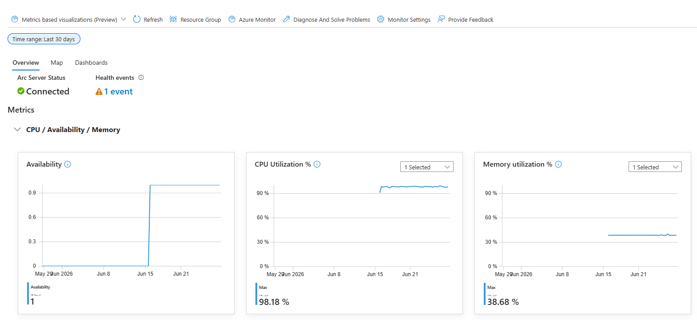
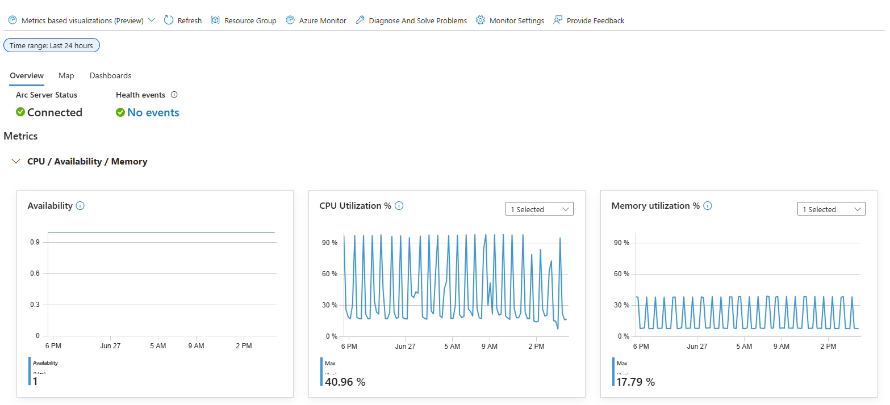

# 06 – Observability & Logging

Operational visibility layer for the EVE Trade Intelligence Platform.

Provides monitoring, execution tracking, logging, alerting, and infrastructure visibility across backend services, worker pipelines, cloud monitoring systems, and physical monitoring hardware.

---

# 🎯 Purpose

Detect failures early, monitor platform health, and provide visibility into automated workflows and infrastructure behavior.

---

# 🛠️ Observability Components

| Area | Coverage |
|---|---|
| Worker Monitoring | Import execution tracking |
| Notifications | Discord alerts |
| Runtime Logs | Docker container logs |
| API Monitoring | Availability checks |
| Database Tracking | Import history records |
| Security Events | UFW and Fail2ban logs |
| Scheduling | Cron execution visibility |
| Infrastructure | Host resource monitoring |
| Retention | Database growth and pruning visibility |
| Public Reachability | External website availability checks |
| Azure Monitoring | Cloud-based monitoring |
| Cloudflare Analytics | Traffic visibility |
| Visitor Statistics | Anonymous daily unique visitor counts |
| Log Retention | Rotation and size limits for host and container logs |
| CYD Display | Physical monitoring dashboard |

---

# 🧱 Key Design Decisions

* Monitoring starts at the worker layer

  * data ingestion is the most critical platform process

* Notifications over manual log inspection

  * failures become visible immediately

* Structured execution tracking

  * import history remains queryable

* Lightweight observability

  * practical visibility without requiring a large monitoring stack

* Hybrid-cloud monitoring

  * infrastructure remains observable remotely

* Security visibility included

  * operational and security monitoring share the same workflow

---

# 📊 Monitoring Scope

Current monitoring covers:

* Worker execution status
* Import duration
* Imported row counts
* API availability
* Database write operations
* Docker container activity
* Scheduled task execution
* Security-related events
* CPU utilization
* Memory utilization
* Storage utilization
* Network throughput
* System temperature
* Public endpoint availability
* Traffic visibility
* Database growth behavior
* Backup storage pressure

---

# 🔄 Worker Monitoring

Tracked information includes:

* Start time
* Completion time
* Execution status
* Imported records
* Error details
* Runtime information

Stored in:

```text
price_import_runs
```

---

# 🔔 Notification System

Discord webhooks provide operational alerts.

### Current Events

* Successful imports
* Failed imports
* API availability issues
* Worker execution summaries
* Public website reachability failures
* Storage and backup pressure warnings

### Benefits

* Faster issue detection
* Reduced manual monitoring
* Improved unattended operation
* Lightweight alerting workflow

---

# ☁️ Azure Monitoring

Implemented through:

* Azure Arc
* Azure Monitor Agent
* Log Analytics Workspace
* OpenTelemetry

### Current Capabilities

* Hybrid-cloud monitoring
* Arc machine connection status
* Heartbeat monitoring
* Offline detection
* CPU utilization visibility
* Memory utilization visibility
* Network visibility
* Logical disk usage visibility
* Health event tracking
* Cloud-based log collection
* Resource visibility
* Alerting support

### Current Azure Arc Status

The self-hosted Linux server is connected to Azure Arc and monitored through Azure Monitor.

The 30-day Azure Monitor view shows one setup-related health event from the initial Azure Arc onboarding phase. No recurring health issues are visible after setup.



<details>
<summary>Open full-size 30-day Azure Monitor screenshot</summary>


</details>

The 24-hour CPU utilization view shows recurring workload spikes caused by scheduled workers and processing jobs. After each workload spike, the server returns to a lower idle baseline instead of staying under constant high load.



<details>
<summary>Open full-size 24-hour CPU screenshot</summary>


</details>

### Cost Control

Monitoring operates behind strict budget limits and alert thresholds to prevent unexpected cloud costs.

---

# 📟 CYD Monitoring Display

A dedicated ESP32 CYD 2.8" display provides real-time infrastructure visibility.

Displayed metrics include:

* API status
* Database status
* Worker status
* CPU utilization
* RAM utilization
* SSD utilization
* Network throughput
* System temperature
* Last synchronization timestamp

Refresh interval:

```text
30 seconds
```

---

# 🌐 Cloudflare Visibility

Cloudflare provides:

* DNS management
* HTTPS protection
* Reverse proxy services
* Basic traffic analytics
* Public endpoint visibility

---

# 📜 Logging Sources

### Database

Structured execution tracking:

```text
price_import_runs
```

### Containers

Runtime visibility for:

* FastAPI
* Worker
* PostgreSQL
* Frontend

Example:

```bash
docker compose logs worker
```

### Host System

* UFW firewall logs
* Fail2ban events
* Ubuntu system logs
* Scheduled task execution
* Pruning and retention logs
* Backup execution logs

---

# ⚙️ Automation Visibility

Worker execution is managed through scheduled cron jobs.

Current workflow:

```text
Cron Schedule
      ↓
Worker Execution
      ↓
Database Tracking
      ↓
Discord Notification
```

This creates a complete audit trail for import operations.

Scheduled workers are protected with a non-blocking `flock` lock so a long-running import cannot overlap with the next cron trigger. This keeps runtime behavior predictable and prevents duplicate high-volume database writes.

Daily pruning jobs keep volatile market and snapshot tables within an intended retention window. Log rotation is used for worker, DDNS, pruning and platform logs so operational visibility does not become a storage risk.

---

# 🚀 Current Capabilities

* Worker execution tracking
* Import history storage
* Discord alerting
* API availability checks
* Docker logging
* Security event visibility
* Scheduled-job monitoring
* Worker overlap prevention
* Database pruning visibility
* Log rotation for long-running operations
* Azure-based monitoring
* Cloudflare traffic visibility
* Real-time hardware monitoring display

---

# 👥 Visitor Statistics

Aggregate reach data for the public platform, collected from the reverse proxy
access log rather than from any client-side tracker.

**Design constraints**

* No accounts, no cookies, no client-side script — consistent with the platform's no-login principle
* No IP address is ever stored. The collector keeps only a salted hash per day
* The day is part of the hash input, so the same visitor produces a different value on a different day and cannot be recognised across days, not even internally
* Automated traffic is classified out: own health checks, crawlers, and requests that bypass the CDN

**Behaviour**

* The collector re-reads the full previous day on every run
* Duplicate counting is prevented by the primary key rather than by bookkeeping, so an interrupted run repairs itself on the next pass
* Daily counters never regress if a partial log window is re-read

**Result**

Daily unique visitor counts are available as an operational metric and are
included in outgoing alert messages, without collecting personal data.

---

# 📈 Current Status

**Live Production Observability Layer**

Provides operational visibility for:

* Market ingestion
* Backend services
* Database operations
* Infrastructure health
* Security monitoring
* Public platform availability

Platform URL:

https://eve-tradelooper.com/
