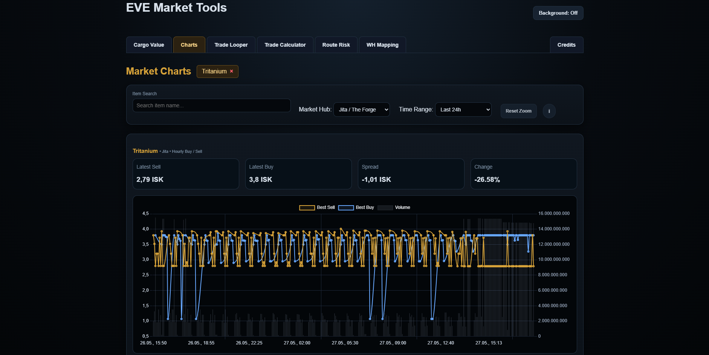
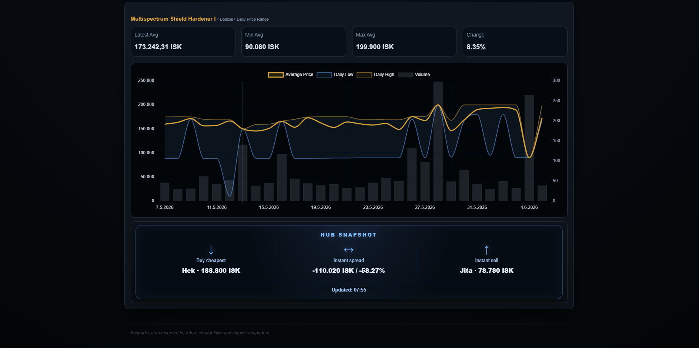

# Market Dashboard

Core frontend application for the EVE Market Platform.

Provides real-time market analysis, historical charting, cargo valuation, route intelligence, and trading tools through a unified browser-based interface.

---

# 🎯 Purpose

Transform raw EVE market data into actionable trading and logistics insights.

---

# 🖼️ Preview






---

# 🛠️ Frontend Modules

| Module        | Purpose                            |
| ------------- | ---------------------------------- |
| Cargo Value   | Inventory valuation & item lookup  |
| Market Charts | Historical market analytics        |
| Trade Looper  | Arbitrage and trade route analysis |
| Route Risk    | Security and route evaluation      |
| WH Mapper     | Wormhole route visualization       |

---

# 🧱 Key Design Decisions

* Modular tab architecture

  * features can evolve independently

* API-driven frontend

  * no direct database access

* Persistent chart sessions

  * open charts survive page refreshes

* Lightweight vanilla JavaScript

  * fast loading and low resource usage

* Real market data only

  * no simulated or static datasets

---

# 📊 Current Features

### Cargo Value

* Direct EVE copy/paste support
* Multi-item parsing
* Quantity detection
* Multilingual item names
* Live market valuation
* Direct chart integration

### Market Charts

* Regional market selection
* Hourly and daily chart modes
* Historical price tracking
* Buy/Sell spread visualization
* Volume analytics
* Multi-chart tabs
* Zoom and drag controls
* Automatic history backfill

### Analytics

* Historical market database integration
* Regional hub comparison
* Interactive chart tooltips
* Session persistence
* Real-time API lookups

---

# 🌍 Supported Trade Hubs

| Hub     | Region      |
| ------- | ----------- |
| Jita    | The Forge   |
| Amarr   | Domain      |
| Dodixie | Sinq Laison |
| Hek     | Metropolis  |
| Rens    | Heimatar    |

---

# 🚀 Data Flow

```text
Browser UI
    ↓
FastAPI Backend
    ↓
PostgreSQL
    ↓
Historical Market Data
    ↓
Interactive Analytics
```

---

# 🔧 Tech Stack

* JavaScript
* HTML
* CSS
* Chart.js
* FastAPI
* PostgreSQL

---

# 📈 Current Status

**Operational**

* Live cargo valuation
* Historical market charts
* Multi-region analytics
* Persistent chart sessions
* Trade utility integration
* Route Risk integration
* Multilingual item support
* Real EVE market data pipeline

---

# 🔮 Planned Expansion

* Moving averages
* Volatility indicators
* Buy/Sell pressure metrics
* Event detection
* AI-assisted market commentary
* Advanced route intelligence
* Expanded trading analytics
