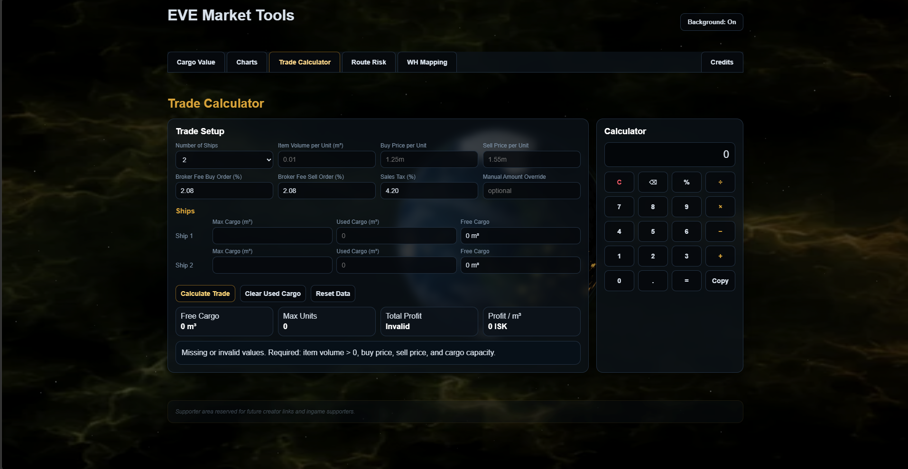

# EVE Trade Cargo Calculator

Standalone browser-based trading and hauling utility for EVE Online.

The tool focuses on practical trade logistics, cargo planning, and profit estimation for station trading and hauling workflows.

Unlike the live market dashboard, this calculator is designed around operational trade calculations rather than historical market analysis or API-driven market visualization.

## Preview

---

# Core Features

- Multi-ship cargo management
- Cargo capacity calculations
- Buy vs sell profit estimation
- Buy order fee and tax simulation
- Profit-per-unit analysis
- Profit-per-m³ analysis
- Manual quantity overrides
- Integrated side calculator
- Smart market number parsing
- Local browser persistence

---

# Trading Workflow Focus

The calculator was designed for common hauling and trading scenarios such as:

- Determining maximum purchasable item amounts
- Estimating hauling profitability
- Comparing market buy/sell margins
- Calculating ISK efficiency per cargo run
- Planning multi-ship transport capacity

The tool prioritizes speed and low interaction overhead during active gameplay.

---

# Local Persistence

The tool stores settings locally in the browser.

### Stored Data

* Ship counts
* Cargo capacities
* Calculator preferences
* Previous calculation settings

No account system, backend, or database is required.

---

# Technology Stack

* HTML5
* CSS3
* Vanilla JavaScript
* LocalStorage

---

# Design Goals

The project focused on:

* Lightweight browser-only architecture
* Fast calculation workflows
* Minimal UI overhead
* Responsive dark UI design
* Fully client-side execution
* Practical usability for active traders and haulers

The calculator intentionally avoids unnecessary complexity and external dependencies.

---

# Current Status

Currently functional as a standalone utility.

Implemented systems include:

* Cargo calculations
* Profit estimation
* Multi-ship support
* Local persistence
* Responsive UI behavior
* Browser-only execution

The tool remains independent from the live market dashboard and focuses specifically on trading logistics and hauling support workflows.
