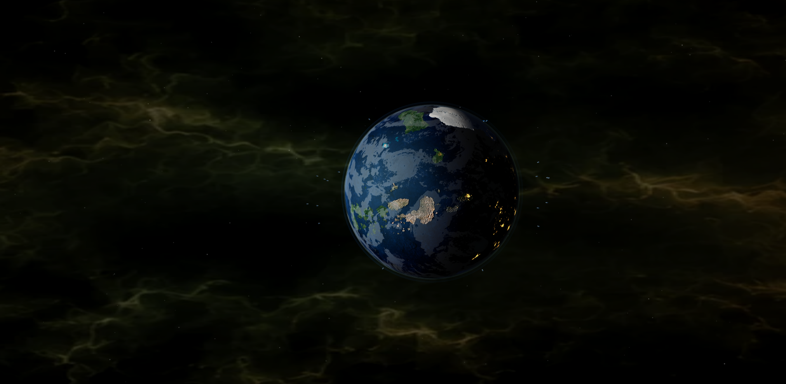

# WebGL Rendering System

Real-time WebGL environment developed for the EVE Trade Intelligence Platform.

Built to create a cinematic sci-fi atmosphere while maintaining low browser resource consumption and stable long-session performance.

---

# 🖼️ Preview



---

# 🎯 Purpose

Enhance the dashboard experience through immersive visuals without impacting analytics performance.

---

# 🛠️ Core Features

| Area             | Features                          |
| ---------------- | --------------------------------- |
| Planet Rendering | Real-time planetary visualization |
| Atmosphere       | Dynamic glow and lighting effects |
| Clouds           | Animated cloud layers             |
| Cities           | Procedural city-light generation  |
| Space Traffic    | Satellite and orbital objects     |
| Environment      | Nebula and deep-space background  |
| Rendering        | Fullscreen WebGL integration      |
| Performance      | Browser-optimized execution       |

---

# 🧱 Key Design Decisions

* GPU-accelerated rendering

  * WebGL and Three.js instead of CPU-heavy animation

* Fully browser-side execution

  * no backend rendering infrastructure

* Modular dashboard integration

  * visual layer remains independent from analytics systems

* Long-session stability

  * optimized for continuous browser runtime

* Memory-first optimization

  * visual quality balanced against resource usage

---

# ⚡ Performance Optimization

Implemented improvements:

* Reduced geometry complexity
* Shared mesh reuse
* Optimized texture handling
* Controlled mipmap generation
* Reduced starfield density
* Improved texture filtering
* Cloud rendering optimization
* Artifact reduction during movement

---

# 📊 Optimization Result

```text id="iwfqg9"
Approximate Browser Memory Usage

~460 MB
    ↓
~186 MB
```

Achieved while maintaining:

* Smooth animation
* Stable rendering
* Responsive interaction
* Visual consistency
* Cinematic presentation

---

# 🚀 Rendering Architecture

```text id="wm8w6j"
Three.js Scene
        ↓
Planet & Atmosphere
        ↓
Cloud Layers
        ↓
Space Objects
        ↓
Nebula Environment
        ↓
WebGL Renderer
        ↓
Browser Display
```

---

# ⚙️ Technology Stack

* Three.js
* WebGL
* GLSL Shaders
* JavaScript
* HTML5
* CSS3

---

# 📈 Current Status

**Completed**

* Real-time WebGL rendering
* Animated planetary environment
* Memory-optimized scene management
* Responsive fullscreen support
* Dashboard integration
* Stable long-session operation

The rendering system serves as a lightweight visual layer for the platform and operates entirely within the browser without requiring backend resources.
