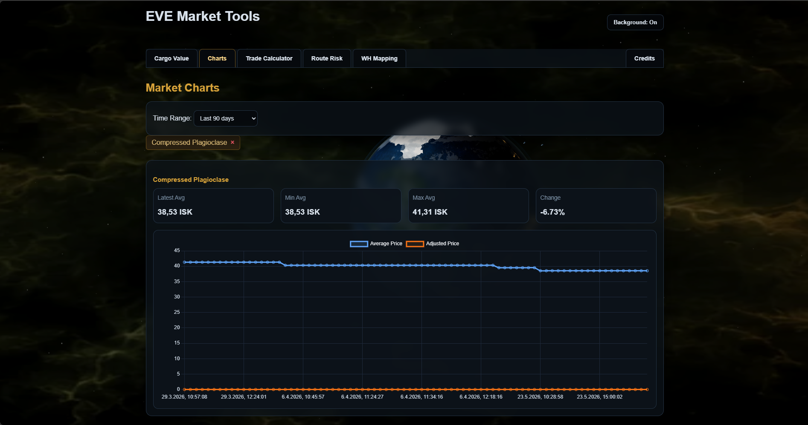

# Live Market Dashboard

Interactive browser-based EVE market dashboard connected to a real backend API and historical market database.

The dashboard combines live cargo valuation, historical regional market analysis, and modular frontend tools into a unified interface powered by real EVE Online market data.

## Preview




---

# Current Features

- Live cargo value calculation
- Historical regional market charts
- Multilingual item support
- Multi-tab dashboard system
- Dynamic chart tabs
- Persistent chart sessions
- Trade utility integration
- Route risk foundation
- Responsive dark UI
- Real API-connected data flow

---

# Dashboard Structure

Current frontend modules:

- Cargo Value
- Charts
- Trade Calculator
- Route Risk
- WH Mapping

The dashboard uses a shared tab-based architecture with modular frontend separation.

---

# Cargo Value Workflow

The Cargo Value module supports direct copy/paste input from EVE Online inventory windows.

Example workflow:

```text
CTRL+C from EVE
→ Paste into dashboard
→ API request
→ Live market lookup
→ Total value calculation
→ Interactive item results
→ Open historical charts
```

---

# Current Cargo Features

- Multi-item parsing
- Quantity detection
- Invalid line handling
- Missing item detection
- Real market price calculation
- ISK formatting
- Clickable item rows
- Direct chart integration
- Multilingual item support

---

# Historical Chart System

Items inside Cargo Value results can directly open historical regional market charts.

## Current Chart Features

- Historical average price tracking
- Average and adjusted price visualization
- Regional market selection
- Multiple open chart tabs
- Closable chart tabs
- Persistent chart sessions
- Automatic history backfill
- Time range selection
- Chart tooltip analytics

### Statistics

Current chart statistics include:

- Latest price
- Minimum price
- Maximum price
- Percentage change
- Daily traded volume
- Order count

### Interaction Features

- Mouse-wheel zoom
- Drag-select zoom
- Reset zoom controls
- Automatic focus behavior

---

# Regional Market Support

Current historical chart support includes:

- Jita / The Forge
- Amarr / Domain
- Dodixie / Sinq Laison
- Hek / Metropolis
- Rens / Heimatar

---

# API Integration

The dashboard is connected to the FastAPI backend and PostgreSQL market database.

### Current Data Flow

```text
Frontend
→ FastAPI
→ PostgreSQL
→ Historical Market Data
→ API Response
→ Interactive UI Rendering
```

### Design Principles

- No direct database access from frontend
- Backend handles calculations and validation
- Frontend focuses on interaction and visualization
- Modular API-driven architecture

---

# UI & Frontend Design

The frontend follows a lightweight EVE-inspired dark UI design.

### Current Focus Areas

- Fast browser rendering
- Responsive layout behavior
- Modular tab architecture
- Interactive workflow design
- Minimal dependency approach
- Expandable frontend systems

---

# Current Status

Currently operational:

- Real API-connected dashboard
- Historical regional market visualization
- Live cargo value calculation
- Interactive multi-chart system
- Persistent chart sessions
- Multilingual item support
- Dynamic chart interaction workflow
- Real EVE market data integration
- Route Risk foundation started

The dashboard has evolved into a modular market analysis platform with real backend integration and persistent historical analytics.

---

# Planned Features

- Moving averages
- Volatility indicators
- Buy/Sell pressure analysis
- AI-assisted market commentary
- Expanded route intelligence
- Additional analytics modules
- Public deployment hardening
