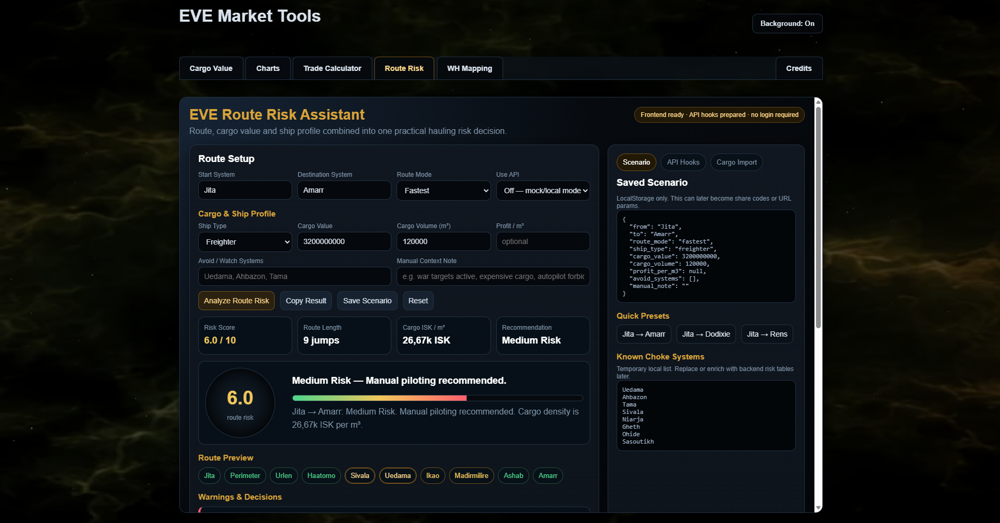
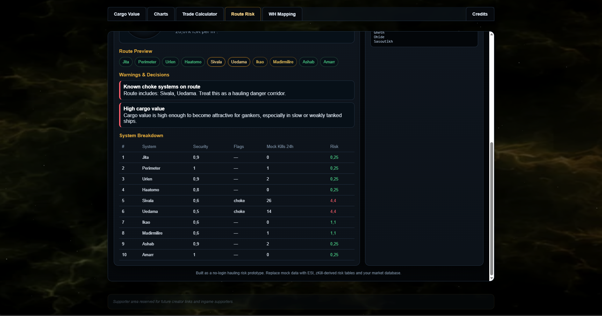

# Route Risk Assistant

Frontend-based hauling and route analysis tool for EVE Online.

The system is designed to combine route information, cargo value, and contextual risk indicators into a practical decision-support tool for traders and haulers.

The current implementation focuses on frontend structure, interaction flow, and future API integration preparation.

## Preview





---

# Current Features

- Route setup interface
- Cargo and ship profile input
- Route mode selection
- Manual danger system filtering
- Risk score calculation
- Scenario saving
- Responsive dashboard UI
- Local-only scenario persistence
- API hook preparation
- EVE-inspired dark UI design

---

# Current Dashboard Sections

### Route Setup

Supports route configuration between systems.

Current inputs:

- Start system
- Destination system
- Route mode
- Ship type
- Cargo value
- Cargo volume
- Profit per m³
- Avoid/watch systems
- Manual context notes

---

### Risk Analysis

The current frontend prototype already calculates and displays simplified route risk estimations.

### Current Indicators

- Risk score
- Route length
- Cargo ISK per m³
- Basic recommendation level

### Current Risk Levels

- Low Risk
- Medium Risk
- High Risk

---

# Scenario System

The tool currently supports local scenario saving through browser storage.

### Current Capabilities

- Save route setups
- Restore previous scenarios
- Lightweight local persistence
- No account system required

---

# Planned API Integration

The current frontend structure was intentionally prepared for future backend connectivity.

### Planned Future Data Sources

- EVE kill statistics
- System activity data
- Player loss tracking
- Route danger indicators
- Historical risk patterns

---

# Planned Future Workflow

```text id="uvygrv"
Route Request
→ Backend/API Analysis
→ System Risk Evaluation
→ Route Scoring
→ Recommendation Output
````

---

# Current Design Goals

The project focuses on:

* Fast route evaluation
* Lightweight browser-based UX
* Expandable risk analysis logic
* Modular dashboard integration
* Practical hauling support tools

---

# Current Status

Currently implemented:

* Full frontend prototype
* Route setup workflow
* Risk display system
* Scenario management
* Modular dashboard integration
* API-ready frontend structure

Backend integration and live risk analysis are planned future expansion areas.

---

# Planned Features

* Live kill-data integration
* Dynamic system danger ratings
* Safer route suggestions
* Historical system risk tracking
* Cargo-aware route scoring
* Regional hauling analysis
* AI-assisted hauling recommendations
